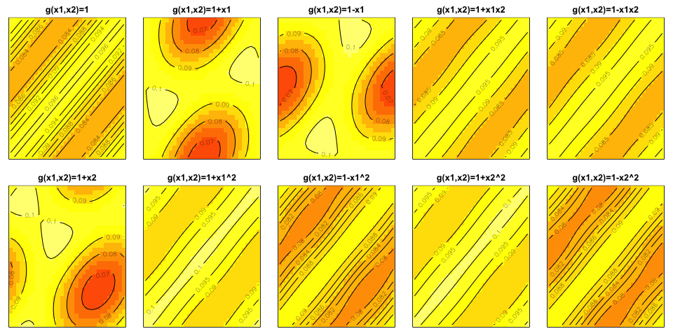
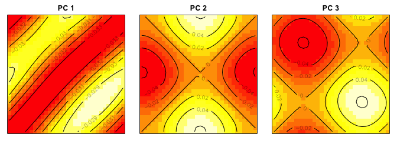

Functional-Input Gaussian Processes with Applications to Inverse
Scattering Problems (Reproducibility)
================
Chih-Li Sung
December 1, 2022

This instruction aims to reproduce the results in the paper
“*Functional-Input Gaussian Processes with Applications to Inverse
Scattering Problems*” by Sung et al. ([https://arxiv.org/abs/2201.01682](https://arxiv.org/abs/2201.01682)).  Hereafter, functional-Input
Gaussian Process is abbreviated by *FIGP*.

The following results are reproduced in this file

-   The sample path plots in Section S8 (Figures S1 and S2)
-   The prediction results in Section 4 (Table 1, Tables S1 and S2)
-   The plots and prediction results in Section 5 (Figures 2, S3 and S4
    and Table 2)

##### Step 0.1: load functions and packages

``` r
library(randtoolbox)
library(R.matlab)
library(cubature)
library(plgp)
source("FIGP.R")                # FIGP 
source("matern.kernel.R")       # matern kernel computation
source("FIGP.kernel.R")         # kernels for FIGP
source("loocv.R")               # LOOCV for FIGP
source("KL.expan.R")            # KL expansion for comparison
source("GP.R")                  # conventional GP
```

##### Step 0.2: setting

``` r
set.seed(1) #set a random seed for reproducing
eps <- sqrt(.Machine$double.eps) #small nugget for numeric stability
```

## Reproducing Section S8: Sample Path

Set up the kernel functions introduced in Section 3. `kernel.linear` is
the linear kernel in Section 3.1, while `kernel.nonlinear` is the
non-linear kernel in Section 3.2.

``` r
kernel.linear <- function(nu, theta, rnd=5000){
  x <- seq(0,2*pi,length.out = rnd)
  R <- sqrt(distance(x*theta))
  Phi <- matern.kernel(R, nu=nu)
  a <- seq(0,1,0.01)
  n <- length(a)
  A <- matrix(0,ncol=n,nrow=rnd)
  for(i in 1:n)  A[,i] <- sin(a[i]*x)
  K <- t(A) %*% Phi %*% A / rnd^2
  return(K)
}
kernel.nonlinear <- function(nu, theta, rnd=5000){
  x <- seq(0,2*pi,length.out = rnd)
  a <- seq(0,1,0.01)
  n <- length(a)
  A <- matrix(0,ncol=n,nrow=rnd)
  for(i in 1:n)  A[,i] <- sin(a[i]*x)
  R <- sqrt(distance(t(A)*theta)/rnd)
  
  K <- matern.kernel(R, nu=nu)
  return(K)
}
```

##### Reproducing Figure S1

Consider a linear kernel with various choices of parameter settings,
including `nu`, `theta`, `s2`.

-   First row: Set `theta=1` and `s2=1` and set different values for
    `nu`, which are 0.5, 3, and 10.
-   Second row: Set `nu=2.5` and `s2=1` and set different values for
    `theta`, which are 0.01, 1, and 100.
-   Third row: Set `nu=2.5` and `theta=1` and set different values for
    `s2`, which are 0.01, 1, and 100.

``` r
theta <- 1
s2 <- 1
nu <- c(0.5,3,10)
K1 <- kernel.linear(nu=nu[1], theta=theta)
K2 <- kernel.linear(nu=nu[2], theta=theta) 
K3 <- kernel.linear(nu=nu[3], theta=theta) 

par(mfrow=c(3,3), mar = c(4, 4, 2, 1))
matplot(seq(0,1,0.01), t(rmvnorm(8,sigma=s2*K1)), type="l", col=1, lty=1, 
        xlab=expression(alpha), ylab="y", main=expression(nu==1/2))
matplot(seq(0,1,0.01), t(rmvnorm(8,sigma=s2*K2)), type="l", col=2, lty=2, 
        xlab=expression(alpha), ylab="y", main=expression(nu==3))
matplot(seq(0,1,0.01), t(rmvnorm(8,sigma=s2*K3)), type="l", col=3, lty=3, xlab=expression(alpha), 
        ylab="y", main=expression(nu==10))

nu <- 2.5
theta <- c(0.01,1,100)
s2 <- 1
K1 <- kernel.linear(nu=nu, theta=theta[1])
K2 <- kernel.linear(nu=nu, theta=theta[2]) 
K3 <- kernel.linear(nu=nu, theta=theta[3])
matplot(seq(0,1,0.01), t(rmvnorm(8,sigma=s2*K1)), type="l", col=1, lty=1, 
        xlab=expression(alpha), ylab="y", main=expression(theta==0.01))
matplot(seq(0,1,0.01), t(rmvnorm(8,sigma=s2*K2)), type="l", col=2, lty=2, 
        xlab=expression(alpha), ylab="y", main=expression(theta==1))
matplot(seq(0,1,0.01), t(rmvnorm(8,sigma=s2*K3)), type="l", col=3, lty=3, xlab=expression(alpha), 
        ylab="y", main=expression(theta==100))

nu <- 2.5
theta <- 1
s2 <- c(0.1,1,100)
K1 <- kernel.linear(nu=nu, theta=theta)
K2 <- kernel.linear(nu=nu, theta=theta) 
K3 <- kernel.linear(nu=nu, theta=theta) 

matplot(seq(0,1,0.01), t(rmvnorm(8,sigma=s2[1]*K1)), type="l", col=1, lty=1, 
        xlab=expression(alpha), ylab="y", main=expression(sigma^2==0.1))
matplot(seq(0,1,0.01), t(rmvnorm(8,sigma=s2[2]*K2)), type="l", col=2, lty=2, 
        xlab=expression(alpha), ylab="y", main=expression(sigma^2==1))
matplot(seq(0,1,0.01), t(rmvnorm(8,sigma=s2[3]*K3)), type="l", col=3, lty=3, xlab=expression(alpha), 
        ylab="y", main=expression(sigma^2==100))
```


##### Reproducing Figure S2

Consider a non-linear kernel with various choices of parameter settings,
including `nu`, `gamma`, `s2`.

-   First row: Set `gamma=1` and `s2=1` and set different values for
    `nu`, which are 0.5, 2, and 10.
-   Second row: Set `nu=2.5` and `s2=1` and set different values for
    `gamma`, which are 0.1, 1, and 10.
-   Third row: Set `nu=2.5` and `gamma=1` and set different values for
    `s2`, which are 0.1, 1, and 100.

``` r
gamma <- 1
s2 <- 1
nu <- c(0.5,2,10)
K1 <- kernel.nonlinear(nu=nu[1], theta=gamma)
K2 <- kernel.nonlinear(nu=nu[2], theta=gamma) 
K3 <- kernel.nonlinear(nu=nu[3], theta=gamma) 

par(mfrow=c(3,3), mar = c(4, 4, 2, 1))
matplot(seq(0,1,0.01), t(rmvnorm(8,sigma=s2*K1)), type="l", col=1, lty=1, 
        xlab=expression(alpha), ylab="y", main=expression(nu==1/2))
matplot(seq(0,1,0.01), t(rmvnorm(8,sigma=s2*K2)), type="l", col=2, lty=2, 
        xlab=expression(alpha), ylab="y", main=expression(nu==2))
matplot(seq(0,1,0.01), t(rmvnorm(8,sigma=s2*K3)), type="l", col=3, lty=3, xlab=expression(alpha), 
        ylab="y", main=expression(nu==10))

nu <- 2.5
gamma <- c(0.1,1,10)
s2 <- 1
K1 <- kernel.nonlinear(nu=nu, theta=gamma[1])
K2 <- kernel.nonlinear(nu=nu, theta=gamma[2]) 
K3 <- kernel.nonlinear(nu=nu, theta=gamma[3])
matplot(seq(0,1,0.01), t(rmvnorm(8,sigma=s2*K1)), type="l", col=1, lty=1, 
        xlab=expression(alpha), ylab="y", main=expression(gamma==0.1))
matplot(seq(0,1,0.01), t(rmvnorm(8,sigma=s2*K2)), type="l", col=2, lty=2, 
        xlab=expression(alpha), ylab="y", main=expression(gamma==1))
matplot(seq(0,1,0.01), t(rmvnorm(8,sigma=s2*K3)), type="l", col=3, lty=3, xlab=expression(alpha), 
        ylab="y", main=expression(gamma==10))

nu <- 2.5
gamma <- 1
s2 <- c(0.1,1,100)
K1 <- kernel.nonlinear(nu=nu, theta=gamma)
K2 <- kernel.nonlinear(nu=nu, theta=gamma) 
K3 <- kernel.nonlinear(nu=nu, theta=gamma) 

matplot(seq(0,1,0.01), t(rmvnorm(8,sigma=s2[1]*K1)), type="l", col=1, lty=1, 
        xlab=expression(alpha), ylab="y", main=expression(sigma^2==0.1))
matplot(seq(0,1,0.01), t(rmvnorm(8,sigma=s2[2]*K2)), type="l", col=2, lty=2, 
        xlab=expression(alpha), ylab="y", main=expression(sigma^2==1))
matplot(seq(0,1,0.01), t(rmvnorm(8,sigma=s2[3]*K3)), type="l", col=3, lty=3, xlab=expression(alpha), 
        ylab="y", main=expression(sigma^2==100))
```


## Reproducing Section 4: Prediction Performance

Three different test functions are considered:

-   $f_1(g)=\int\int g$
-   $f_2(g)=\int\int g^3$
-   $f_3(g)=\int\int \sin(g^2)$

Eight training functional inputs are

-   $g(x_1,x_2)=x_1+x_2$
-   $g(x_1,x_2)=x_1^2$
-   $g(x_1,x_2)=x_2^2$
-   $g(x_1,x_2)=1+x_1$
-   $g(x_1,x_2)=1+x_2$
-   $g(x_1,x_2)=1+x_1x_2$
-   $g(x_1,x_2)=\sin(x_1)$
-   $g(x_1,x_2)=\cos(x_1+x_2)$

The domain space of $x$ is $[0,1]^2$.

Test functional inputs are

-   $g(x_1,x_2)=\sin(\alpha_1x_1+\alpha_2x_2)$
-   $g(x_1,x_2)=\beta +x_1^2+x_2^3$
-   $g(x_1,x_2)=\exp(-\kappa x_1x_2)$

with random $\alpha_1,\alpha_2, \beta$ and $\kappa$ from $[0,1]$.

``` r
# training functional inputs (G)
G <- list(function(x) x[1]+x[2],
          function(x) x[1]^2,
          function(x) x[2]^2,
          function(x) 1+x[1],
          function(x) 1+x[2],
          function(x) 1+x[1]*x[2],
          function(x) sin(x[1]),
          function(x) cos(x[1]+x[2]))
n <- length(G)
# y1: integrate g function from 0 to 1
y1 <- rep(0, n) 
for(i in 1:n) y1[i] <- hcubature(G[[i]], lower=c(0, 0),upper=c(1,1))$integral

# y2: integrate g^3 function from 0 to 1
G.cubic <- list(function(x) (x[1]+x[2])^3,
                 function(x) (x[1]^2)^3,
                 function(x) (x[2]^2)^3,
                 function(x) (1+x[1])^3,
                 function(x) (1+x[2])^3,
                 function(x) (1+x[1]*x[2])^3,
                 function(x) (sin(x[1]))^3,
                 function(x) (cos(x[1]+x[2]))^3)
y2 <- rep(0, n) 
for(i in 1:n) y2[i] <- hcubature(G.cubic[[i]], lower=c(0, 0),upper=c(1,1))$integral

# y3: integrate sin(g^2) function from 0 to 1
G.sin <- list(function(x) sin((x[1]+x[2])^2),
              function(x) sin((x[1]^2)^2),
              function(x) sin((x[2]^2)^2),
              function(x) sin((1+x[1])^2),
              function(x) sin((1+x[2])^2),
              function(x) sin((1+x[1]*x[2])^2),
              function(x) sin((sin(x[1]))^2),
              function(x) sin((cos(x[1]+x[2]))^2))
y3 <- rep(0, n) 
for(i in 1:n) y3[i] <- hcubature(G.sin[[i]], lower=c(0, 0),upper=c(1,1))$integral
```

##### Reproducing Table S1

``` r
Y <- cbind(y1,y2,y3)
knitr::kable(round(t(Y),2))
```

|     |      |      |      |      |      |      |      |      |
|:----|-----:|-----:|-----:|-----:|-----:|-----:|-----:|-----:|
| y1  | 1.00 | 0.33 | 0.33 | 1.50 | 1.50 | 1.25 | 0.46 | 0.50 |
| y2  | 1.50 | 0.14 | 0.14 | 3.75 | 3.75 | 2.15 | 0.18 | 0.26 |
| y3  | 0.62 | 0.19 | 0.19 | 0.49 | 0.49 | 0.84 | 0.26 | 0.33 |

Now we are ready to fit a FIGP model. In each for loop, we fit a FIGP
for each of `y1`, `y2` and `y3`. In each for loop, we also compute LOOCV
errors by `loocv` function.

``` r
loocv.l <- loocv.nl <- rep(0,3)
gp.fit <- gpnl.fit <- vector("list", 3)
set.seed(1)
for(i in 1:3){
  # fit FIGP with a linear kernel
  gp.fit[[i]] <- FIGP(G, d=2, Y[,i], nu=2.5, nug=eps, kernel="linear")
  loocv.l[i] <- loocv(gp.fit[[i]])
  
  # fit FIGP with a nonlinear kernel
  gpnl.fit[[i]] <- FIGP(G, d=2, Y[,i], nu=2.5, nug=eps, kernel="nonlinear")
  loocv.nl[i] <- loocv(gpnl.fit[[i]])
}
```

As a comparison, we consider two basis expansion approaches. The first
method is KL expansion.

``` r
# for comparison: basis expansion approach
# KL expansion that explains 99% of the variance
set.seed(1)
KL.out <- KL.expan(d=2, G, fraction=0.99, rnd=1e3)
B <- KL.out$B
  
KL.fit <- vector("list", 3)
# fit a conventional GP on the scores
for(i in 1:3) KL.fit[[i]] <- sepGP(B, Y[,i], nu=2.5, nug=eps)
```

The second method is Taylor expansion with degree 3.

``` r
# for comparison: basis expansion approach
# Taylor expansion coefficients for each functional input
taylor.coef <- matrix(c(0,1,1,rep(0,7),
                        rep(0,4),1,rep(0,5),
                        rep(0,5),1,rep(0,4),
                        rep(1,2),rep(0,8),
                        1,0,1,rep(0,7),
                        1,0,0,1,rep(0,6),
                        0,1,rep(0,6),-1/6,0,
                        1,0,0,-1,-1/2,-1/2,rep(0,4)),ncol=10,byrow=TRUE)

TE.fit <- vector("list", 3)
# fit a conventional GP on the coefficients
for(i in 1:3) TE.fit[[i]] <- sepGP(taylor.coef, Y[,i], nu=2.5, nug=eps, scale.fg=FALSE, iso.fg=TRUE)
```

Let’s make predictions on the test functional inputs. We test `n.test`
times.

``` r
set.seed(1)
n.test <- 100

alpha1 <- runif(n.test,0,1)
alpha2 <- runif(n.test,0,1)
beta1 <- runif(n.test,0,1)
kappa1 <- runif(n.test,0,1)

mse.linear <- mse.nonlinear <- mse.kl <- mse.te <- 
  cvr.linear <- cvr.nonlinear <- cvr.kl <- cvr.te <- 
  score.linear <- score.nonlinear <- score.kl <- score.te <-rep(0,3)

# scoring rule function
score <- function(x, mu, sig2){
  if(any(sig2==0)) sig2[sig2==0] <- eps
  -(x-mu)^2/sig2-log(sig2)
}

for(i in 1:3){
  mse.linear.i <- mse.nonlinear.i <- mse.kl.i <- mse.te.i <- 
    cvr.linear.i <- cvr.nonlinear.i <- cvr.kl.i <- cvr.te.i <- 
    score.linear.i <- score.nonlinear.i <- score.kl.i <- score.te.i <- rep(0, n.test)
  for(ii in 1:n.test){
    gnew <- list(function(x) sin(alpha1[ii]*x[1]+alpha2[ii]*x[2]),
                 function(x) beta1[ii]+x[1]^2+x[2]^3,
                 function(x) exp(-kappa1[ii]*x[1]*x[2]))    
    if(i==1){
      g.int <- gnew
    }else if(i==2){
      g.int <- list(function(x) (sin(alpha1[ii]*x[1]+alpha2[ii]*x[2]))^3,
                    function(x) (beta1[ii]+x[1]^2+x[2]^3)^3,
                    function(x) (exp(-kappa1[ii]*x[1]*x[2]))^3)
    }else if(i==3){
      g.int <- list(function(x) sin((sin(alpha1[ii]*x[1]+alpha2[ii]*x[2]))^2),
                    function(x) sin((beta1[ii]+x[1]^2+x[2]^3)^2),
                    function(x) sin((exp(-kappa1[ii]*x[1]*x[2]))^2))
    }
    
    n.new <- length(gnew)
    y.true <- rep(0,n.new)
    for(iii in 1:n.new) y.true[iii] <- hcubature(g.int[[iii]], lower=c(0, 0),upper=c(1,1))$integral
    
    # FIGP: linear kernel
    ynew <- pred.FIGP(gp.fit[[i]], gnew)
    mse.linear.i[ii] <- mean((y.true - ynew$mu)^2)
    lb <- ynew$mu - qnorm(0.975)*sqrt(ynew$sig2)
    ub <- ynew$mu + qnorm(0.975)*sqrt(ynew$sig2)
    cvr.linear.i[ii] <- mean(y.true > lb & y.true < ub)
    score.linear.i[ii] <- mean(score(y.true, ynew$mu, ynew$sig2))
    
    # FIGP: nonlinear kernel
    ynew <- pred.FIGP(gpnl.fit[[i]], gnew)
    mse.nonlinear.i[ii] <- mean((y.true - ynew$mu)^2)
    lb <- ynew$mu - qnorm(0.975)*sqrt(ynew$sig2)
    ub <- ynew$mu + qnorm(0.975)*sqrt(ynew$sig2)
    cvr.nonlinear.i[ii] <- mean(y.true > lb & y.true < ub)
    score.nonlinear.i[ii] <- mean(score(y.true, ynew$mu, ynew$sig2))
    
    # FPCA
    B.new <- KL.Bnew(KL.out, gnew)
    ynew <- pred.sepGP(KL.fit[[i]], B.new)
    mse.kl.i[ii] <- mean((y.true - ynew$mu)^2)
    lb <- ynew$mu - qnorm(0.975)*sqrt(ynew$sig2)
    ub <- ynew$mu + qnorm(0.975)*sqrt(ynew$sig2)
    cvr.kl.i[ii] <- mean(y.true > lb & y.true < ub)
    score.kl.i[ii] <- mean(score(y.true, ynew$mu, ynew$sig2))
    
    # Taylor expansion
    taylor.coef.new <- matrix(c(0,alpha1[ii],alpha2[ii],0,0,0,alpha1[ii]^2*alpha2[ii]/2,alpha1[ii]*alpha2[ii]^2/2,alpha1[ii]^3/6,alpha2[ii]^3/6,
                                beta1[ii],rep(0,3),1,rep(0,4),1,
                                1,0,0,-kappa1[ii],rep(0,6)),ncol=10,byrow=TRUE)
    ynew <- pred.sepGP(TE.fit[[i]], taylor.coef.new)
    mse.te.i[ii] <- mean((y.true - ynew$mu)^2)
    lb <- ynew$mu - qnorm(0.975)*sqrt(ynew$sig2)
    ub <- ynew$mu + qnorm(0.975)*sqrt(ynew$sig2)
    cvr.te.i[ii] <- mean(y.true > lb & y.true < ub)
    score.te.i[ii] <- mean(score(y.true, ynew$mu, ynew$sig2))
  }
  mse.linear[i] <- mean(mse.linear.i)
  mse.nonlinear[i] <- mean(mse.nonlinear.i)
  mse.kl[i] <- mean(mse.kl.i)
  mse.te[i] <- mean(mse.te.i)
  cvr.linear[i] <- mean(cvr.linear.i)*100
  cvr.nonlinear[i] <- mean(cvr.nonlinear.i)*100
  cvr.kl[i] <- mean(cvr.kl.i)*100
  cvr.te[i] <- mean(cvr.te.i)*100
  score.linear[i] <- mean(score.linear.i)
  score.nonlinear[i] <- mean(score.nonlinear.i)
  score.kl[i] <- mean(score.kl.i)
  score.te[i] <- mean(score.te.i)
}
```

##### Reproducing Table 1

``` r
out <- rbind(format(loocv.l,digits=4),
             format(loocv.nl,digits=4),
             format(mse.linear,digits=4),
             format(mse.nonlinear,digits=4),
             format(sapply(gp.fit,"[[", "ElapsedTime"),digits=4),
             format(sapply(gpnl.fit,"[[", "ElapsedTime"),digits=4))
rownames(out) <- c("linear LOOCV", "nonlinear LOOCV", "linear MSE", "nonlinear MSE", "linear time", "nonlinear time")
colnames(out) <- c("y1", "y2", "y3")
knitr::kable(out)
```

|                 | y1        | y2        | y3        |
|:----------------|:----------|:----------|:----------|
| linear LOOCV    | 7.867e-07 | 1.813e+00 | 4.541e-01 |
| nonlinear LOOCV | 2.150e-06 | 2.274e-01 | 1.662e-02 |
| linear MSE      | 6.388e-10 | 1.087e+00 | 1.397e-01 |
| nonlinear MSE   | 3.087e-07 | 1.176e-02 | 1.640e-02 |
| linear time     | 8.650     | 8.488     | 8.450     |
| nonlinear time  | 0.728     | 0.908     | 0.972     |

##### Reproducing Table S2

``` r
select.idx <- apply(rbind(loocv.l, loocv.nl), 2, which.min)
select.mse <- diag(rbind(mse.linear, mse.nonlinear)[select.idx,])
select.cvr <- diag(rbind(cvr.linear, cvr.nonlinear)[select.idx,])
select.score <- diag(rbind(score.linear, score.nonlinear)[select.idx,])

out <- rbind(format(select.mse,digits=4),
             format(mse.kl,digits=4),
             format(mse.te,digits=4),
             format(select.cvr,digits=4),
             format(cvr.kl,digits=4),
             format(cvr.te,digits=4),
             format(select.score,digits=4),
             format(score.kl,digits=4),
             format(score.te,digits=4))
rownames(out) <- c("FIGP MSE", "Basis MSE", "T3 MSE", 
                   "FIGP coverage", "Basis coverage", "T3 coverage", 
                   "FIGP score", "Basis score", "T3 score")
colnames(out) <- c("y1", "y2", "y3")
knitr::kable(out)
```

|                | y1        | y2        | y3        |
|:---------------|:----------|:----------|:----------|
| FIGP MSE       | 6.388e-10 | 1.176e-02 | 1.640e-02 |
| Basis MSE      | 0.0001827 | 0.1242804 | 0.0227310 |
| T3 MSE         | 0.09349   | 1.27116   | 0.04747   |
| FIGP coverage  | 96.33     | 100.00    | 100.00    |
| Basis coverage | 100.00    | 92.33     | 76.00     |
| T3 coverage    | 100.00    | 98.33     | 100.00    |
| FIGP score     | 14.899    | 2.571     | 3.458     |
| Basis score    | 6.6306    | 1.2074    | 0.2902    |
| T3 score       | 1.064     | -1.364    | 2.047     |

## Reproducing Section 5: Inverse Scattering Problems

Now we move to a real problem: inverse scattering problem. First, since
the data were generated through Matlab, we use the function `readMat` in
the package `R.matlab` to read the data. There were ten training data
points, where the functional inputs are

-   $g(x_1,x_2)=1$
-   $g(x_1,x_2)=1+x_1$
-   $g(x_1,x_2)=1-x_1$
-   $g(x_1,x_2)=1+x_1x_2$
-   $g(x_1,x_2)=1-x_1x_2$
-   $g(x_1,x_2)=1+x_2$
-   $g(x_1,x_2)=1+x_1^2$
-   $g(x_1,x_2)=1-x_1^2$
-   $g(x_1,x_2)=1+x_2^2$
-   $g(x_1,x_2)=1-x_2^2$

##### Reproducing Figure 2

The outputs are displayed as follows, which reproduces Figure 2.

``` r
func.title <- c("g(x1,x2)=1", "g(x1,x2)=1+x1", "g(x1,x2)=1-x1","g(x1,x2)=1+x1x2",
                "g(x1,x2)=1-x1x2","g(x1,x2)=1+x2","g(x1,x2)=1+x1^2","g(x1,x2)=1-x1^2",
                "g(x1,x2)=1+x2^2","g(x1,x2)=1-x2^2")

output.mx <- matrix(0,nrow=10,ncol=32*32)
par(mfrow=c(2,5))
par(mar = c(1, 1, 2, 1))
for(i in 1:10){
  g.out <- readMat(paste0("DATA/q_func",i,".mat"))$Ffem
  image(Re(g.out), zlim=c(0.05,0.11),yaxt="n",xaxt="n",
        col=heat.colors(12, rev = FALSE),
        main=func.title[i])
  contour(Re(g.out), add = TRUE, nlevels = 5)
  output.mx[i,] <- c(Re(g.out))
}
```



We perform PCA (principal component analysis) for dimension reduction,
which shows that only three components can explain more than 99.99%
variation of the data.

``` r
pca.out <- prcomp(output.mx, scale = FALSE, center = FALSE)
n.comp <- which(summary(pca.out)$importance[3,] > 0.9999)[1]
print(n.comp)
```

    ## PC3 
    ##   3

##### Reproducing Figure S3

Plot the three principal components, which reproduces Figure S3.

``` r
par(mfrow=c(1,3))
par(mar = c(1, 1, 2, 1))
for(i in 1:n.comp){
  eigen.vec <- matrix(c(pca.out$rotation[,i]), 32, 32)
  image(eigen.vec,yaxt="n",xaxt="n",
        col=heat.colors(12, rev = FALSE),
        main=paste("PC",i))
  contour(eigen.vec, add = TRUE, nlevels = 5)
}
```



Now we are ready to fit the FIGP model on those PC scores. Similarly, we
fit the FIGP with a linear kernel and a nonlinear kernel.

``` r
# training functional inputs (G)
G <- list(function(x) 1,
          function(x) 1+x[1],
          function(x) 1-x[1],
          function(x) 1+x[1]*x[2],
          function(x) 1-x[1]*x[2],
          function(x) 1+x[2],
          function(x) 1+x[1]^2,
          function(x) 1-x[1]^2,
          function(x) 1+x[2]^2,
          function(x) 1-x[2]^2)
n <- length(G)

set.seed(1)
gp.fit <- gpnl.fit <- vector("list",n.comp)
for(i in 1:n.comp){
  y <- pca.out$x[,i]
  # fit FIGP with a linear kernel  
  gp.fit[[i]] <- FIGP(G, d=2, y, nu=2.5, nug=eps, kernel = "linear")
  # fit FIGP with a nonlinear kernel    
  gpnl.fit[[i]] <- FIGP(G, d=2, y, nu=2.5, nug=eps, kernel = "nonlinear")
}
```

Perform a LOOCV to see which kernel is a better choice.

``` r
loocv.recon <- sapply(gp.fit, loocv.pred) %*% t(pca.out$rotation[,1:n.comp])
loocv.linear <- mean((loocv.recon - output.mx)^2)

loocv.nl.recon <- sapply(gpnl.fit, loocv.pred) %*% t(pca.out$rotation[,1:n.comp])
loocv.nonlinear <- mean((loocv.nl.recon - output.mx)^2)

out <- c(loocv.linear, loocv.nonlinear)
names(out) <- c("linear", "nonlinear")
print(out)
```

    ##       linear    nonlinear 
    ## 3.648595e-06 1.156923e-05

We see linear kernel leads to a smaller LOOCV, which indicates that it’s
a better choice.

##### Reproducing Figure S4

Thus, we perform the predictions on a test input using the FIGP model
with the linear kernel, which is

-   $g(x_1,x_2)=1-\sin(x_2)$

``` r
# test functional inputs (gnew)
gnew <- list(function(x) 1-sin(x[2]))
n.new <- length(gnew)

# make predictions using a linear kernel
ynew <- s2new <- matrix(0,ncol=n.comp,nrow=n.new)
for(i in 1:n.comp){
  pred.out <- pred.FIGP(gp.fit[[i]], gnew)
  ynew[,i] <- pred.out$mu
  s2new[,i] <- pred.out$sig2
}

# reconstruct the image
pred.recon <- ynew %*% t(pca.out$rotation[,1:n.comp])
s2.recon <- s2new %*% t(pca.out$rotation[,1:n.comp]^2)

# FPCA method for comparison
KL.out <- KL.expan(d=2, G, fraction=0.99, rnd=1e3)
B <- KL.out$B
B.new <- KL.Bnew(KL.out, gnew)

ynew <- s2new <- matrix(0,ncol=n.comp,nrow=n.new)
KL.fit <- vector("list", n.comp)
for(i in 1:n.comp){
  KL.fit[[i]] <- sepGP(B, pca.out$x[,i], nu=2.5, nug=eps)
  pred.out <- pred.sepGP(KL.fit[[i]], B.new)
  ynew[,i] <- drop(pred.out$mu)
  s2new[,i] <- drop(pred.out$sig2)
}

# reconstruct the image
pred.KL.recon <- ynew %*% t(pca.out$rotation[,1:n.comp])
s2.KL.recon <- s2new %*% t(pca.out$rotation[,1:n.comp]^2)

# Taylor method for comparison
ynew <- s2new <- matrix(0,ncol=n.comp,nrow=n.new)
taylor.coef <- matrix(c(c(1,1,0,0,0,0,0),
                      c(1,-1,0,0,0,0,0),
                      c(1,0,0,1,0,0,0),
                      c(1,0,0,-1,0,0,0),
                      c(1,0,1,0,0,0,0),
                      c(1,0,-1,0,0,0,0),
                      c(1,0,0,0,1,0,0),
                      c(1,0,0,0,-1,0,0),
                      c(1,0,0,0,0,1,0),
                      c(1,0,0,0,0,-1,0)),ncol=7,byrow=TRUE)
taylor.coef.new <- matrix(c(1,0,-1,0,0,0,1/6),ncol=7)

TE.fit <- vector("list", n.comp)
for(i in 1:n.comp) {
  TE.fit[[i]] <- sepGP(taylor.coef, pca.out$x[,i], nu=2.5, nug=eps, scale.fg=FALSE, iso.fg=TRUE)
  pred.out <- pred.sepGP(TE.fit[[i]], taylor.coef.new)
  ynew[,i] <- drop(pred.out$mu)
  s2new[,i] <- drop(pred.out$sig2)
}

# reconstruct the image
pred.TE.recon <- ynew %*% t(pca.out$rotation[,1:n.comp])
s2.TE.recon <- s2new %*% t(pca.out$rotation[,1:n.comp]^2)

# true data on the test data
gnew.true <- matrix(0, ncol=n.new, nrow=32*32)
gnew.dat <- readMat(paste0("DATA/q_sine.mat"))$Ffem
gnew.true[,1] <- c(Re(gnew.dat))


# plot the result
par(mfrow=c(3,3))
par(mar = c(1, 1, 2, 1))

mse.figp <- mse.kl <- mse.taylor <- 
  score.figp <- score.kl <- score.taylor <- rep(0, n.new)

for(i in 1:n.new){
  image(matrix(gnew.true[,i],32,32), zlim=c(0.05,0.11),yaxt="n",xaxt="n",
        col=heat.colors(12, rev = FALSE),
        main=ifelse(i==1, "g(x1,x2)=1-sin(x2)", "g(x1,x2)=1"))
  contour(matrix(gnew.true[,i],32,32), add = TRUE, nlevels = 5)
  
  image(matrix(pred.recon[i,], 32, 32), zlim=c(0.05,0.11),yaxt="n",xaxt="n",
        col=heat.colors(12, rev = FALSE),
        main="FIGP prediction")
  contour(matrix(pred.recon[i,], 32, 32), add = TRUE, nlevels = 5)
  
  image(matrix(log(s2.recon[i,]), 32, 32), zlim=c(-16,-9), yaxt="n",xaxt="n",
        col=cm.colors(12, rev = FALSE),
        main="FIGP log(variance)")
  contour(matrix(log(s2.recon[i,]), 32, 32), add = TRUE, nlevels = 5)
  
  mse.figp[i] <- mean((gnew.true[,i]-pred.recon[i,])^2)
  score.figp[i] <- mean(score(gnew.true[,i], pred.recon[i,], s2.recon[i,]))
  
  # empty plot
  plot.new()
  
  image(matrix(pred.KL.recon[i,], 32, 32), zlim=c(0.05,0.11),yaxt="n",xaxt="n",
        col=heat.colors(12, rev = FALSE),
        main="FPCA prediction")
  contour(matrix(pred.KL.recon[i,], 32, 32), add = TRUE, nlevels = 5)
  mse.kl[i] <- mean((gnew.true[,i]-pred.KL.recon[i,])^2)
  score.kl[i] <- mean(score(gnew.true[,i], pred.KL.recon[i,], s2.KL.recon[i,]))
  
  image(matrix(log(s2.KL.recon[i,]), 32, 32), zlim=c(-16,-9), yaxt="n",xaxt="n",
        col=cm.colors(12, rev = FALSE),
        main="FPCA log(variance)")
  contour(matrix(log(s2.KL.recon[i,]), 32, 32), add = TRUE, nlevels = 5)
  
  # empty plot
  plot.new()
  
  image(matrix(pred.TE.recon[i,], 32, 32), zlim=c(0.05,0.11),yaxt="n",xaxt="n",
        col=heat.colors(12, rev = FALSE),
        main="T3 prediction")
  contour(matrix(pred.TE.recon[i,], 32, 32), add = TRUE, nlevels = 5)
  
  image(matrix(log(s2.TE.recon[i,]), 32, 32), zlim=c(-16,-9), yaxt="n",xaxt="n",
        col=cm.colors(12, rev = FALSE),
        main="T3 log(variance)")
  contour(matrix(log(s2.TE.recon[i,]), 32, 32), add = TRUE, nlevels = 5)
  
  mse.taylor[i] <- mean((gnew.true[,i]-pred.TE.recon[i,])^2)
  score.taylor[i] <- mean(score(gnew.true[,i], pred.TE.recon[i,], s2.TE.recon[i,]))
}
```


##### Reproducing Table 2

The prediction performance for the test data is given below.

``` r
out <- cbind(mse.figp, mse.kl, mse.taylor)
out <- rbind(out, cbind(score.figp, score.kl, score.taylor))
colnames(out) <- c("FIGP", "FPCA", "T3")
rownames(out) <- c("MSE", "score")
knitr::kable(out)
```

|       |       FIGP |     FPCA |        T3 |
|:------|-----------:|---------:|----------:|
| MSE   |  0.0000011 | 0.000107 | 0.0000906 |
| score | 12.1301269 | 6.890083 | 6.3916707 |
